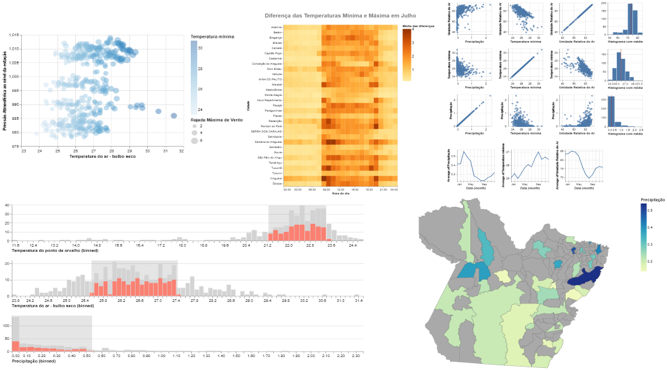

# Tutorial - Vega Lite API & Altair <a href="https://altair-viz.github.io/"></img></a> <a href="https://vega.github.io/vega-lite/"></img></a> 

Material para as classes práticas de Visualização da Informação da UFPA.

## Conteúdo

* [Índice dos notebooks no Observable](https://observablehq.com/@tiagodavi70/indice-vl-altair-tutorial)

1. Introdução, tipos de dados e Variáveis Visuais  
   <small>
     [Pré Visualização - Jupyter Notebook](https://nbviewer.jupyter.org/github/tiagodavi70/vl-altair-tutorial/blob/b9fbe725da0cf554c7608586f490afaa6d71cd10/notebooks/Altair_1_Introducao.ipynb) |
     [Abrir no Colab](https://colab.research.google.com/github/tiagodavi70/vl-altair-tutorial/blob/master/notebooks/Altair_1_Introducao.ipynb) |
     [Abrir no Observable](https://observablehq.com/@tiagodavi70/introducao-tipos-de-dados-e-variaveis-visuais)
   </small>

2. Transformações e Personalização  
   <small>
     [Pré Visualização - Jupyter Notebook](https://nbviewer.jupyter.org/github/tiagodavi70/vl-altair-tutorial/blob/b9fbe725da0cf554c7608586f490afaa6d71cd10/notebooks/Altair_2_Dados.ipynb) |
     [Abrir no Colab](https://colab.research.google.com/github/tiagodavi70/vl-altair-tutorial/blob/master/notebooks/Altair_2_Dados.ipynb) |
     [Abrir no Observable](https://observablehq.com/@tiagodavi70/transformacoes-e-personalizacao)
   </small>

3. Múltiplas Visões 
   <small>
     [Pré Visualização - Jupyter Notebook](https://nbviewer.jupyter.org/github/tiagodavi70/vl-altair-tutorial/blob/b9fbe725da0cf554c7608586f490afaa6d71cd10/notebooks/Altair_3_Visoes.ipynb) |
     [Abrir no Colab](https://colab.research.google.com/github/tiagodavi70/vl-altair-tutorial/blob/master/notebooks/Altair_3_Visoes.ipynb) | 
     [Abrir no Observable](https://observablehq.com/@tiagodavi70/multiplas-visoes)
   </small>

4. Interação 
   <small>
     [Pré Visualização - Jupyter Notebook](https://nbviewer.jupyter.org/github/tiagodavi70/vl-altair-tutorial/blob/b9fbe725da0cf554c7608586f490afaa6d71cd10/notebooks/Altair_4_Interacao.ipynb) |
     [Abrir no Colab](https://colab.research.google.com/github/tiagodavi70/vl-altair-tutorial/blob/master/notebooks/Altair_4_Interacao.ipynb) | [Abrir no Observable](https://observablehq.com/@tiagodavi70/interacao)
   </small>

5. Cartografia 
   <small>
     [Pré Visualização - Jupyter Notebook](https://nbviewer.jupyter.org/github/tiagodavi70/vl-altair-tutorial/blob/master/notebooks/Altair_5_Cartografia.ipynb) |
     [Abrir no Colab](https://colab.research.google.com/github/tiagodavi70/vl-altair-tutorial/blob/master/notebooks/Altair_5_Cartografia.ipynb) | [Abrir no Observable](https://observablehq.com/@tiagodavi70/cartografia)
   </small>

## Como usar

Os notebooks podem ser usados online ou localmente.

* Para usar a versão de JS no `Observable`, basta clicar nos links na lista acima.
* Para ver a versão de Python online no `nbviewer`, clique nos links de pré-visualização acima.
* Para usar a versão de Python online no `Colab`, clique nos links do Colab acima.
* Para usar localmente, siga as instruções abaixo.

## Usar localmente

* Instale [Altair](https://altair-viz.github.io/getting_started/installation.html) e [um ambiente de notebooks](https://jupyter.org/install)
* Clone o repositório.
* Abra os notebooks no seu ambiente local. Por exemplo, com Jupyter Lab, execute `jupyter lab` na pasta dos notebooks.

## Links importantes

[CS231n Python Tutorial With Google Colab](https://colab.research.google.com/github/cs231n/cs231n.github.io/blob/master/python-colab.ipynb#scrollTo=nxvEkGXPM3Xh)

[O que é o Colaboratory?](https://colab.research.google.com/notebooks/intro.ipynb)

[A Minimal Introduction to JavaScript and Observable](https://observablehq.com/@uwdata/a-minimal-introduction-to-javascript-and-observable)

[Galeria](https://altair-viz.github.io/gallery/index.html)

[Exemplos de uso](https://observablehq.com/collection/@vega/vega-lite-api)

## Inspirado por:

<a href="https://github.com/uwdata/visualization-curriculum"> Visualization Curriculum - Universidade de Washington </a>

<a href="https://www.youtube.com/watch?v=ZV_Yjcs5WtM">Observable Vega-Lite: A Crash Course</a>

<a href="https://github.com/altair-viz/altair-tutorial">Tutorial de Altair</a>

<a href="https://www.youtube.com/watch?v=ms29ZPUKxbU">Jake VanderPlas - Exploratory Data Visualization with Vega, Vega-Lite, and Altair - PyCon 2018 </a>

## Extra

<a href="https://idl.cs.washington.edu/papers/vega-lite/"> Vega-Lite: A Grammar of Interactive Graphics - Artigo</a>

<a href="https://www.youtube.com/watch?v=Nsrz4YdaZ_A">Vega-Lite: A Grammar of Interactive Graphics - Apresentação</a>

<a href="https://infovis.fh-potsdam.de/tutorials/"> Information Visualization course at Fachhochschule Potsdam - summer 2020</a>

<a href="https://observablehq.com/collection/@observablehq/observable-for-vega-lite"> Observable for Vega-Lite </a>

[Apresentação do Vega-Lite na OpenVisConf 2017](https://www.youtube.com/watch?v=9uaHRWj04D4)

[Tutorial InfoVis - FH Potsdam](https://infovis.fh-potsdam.de/tutorials/)

## Crédito

MSc. Tiago Araújo e Prof. Dr. Bianchi Serique Meiguins são responsáveis pela tradução, revisão e novo conteúdo nos notebooks.
